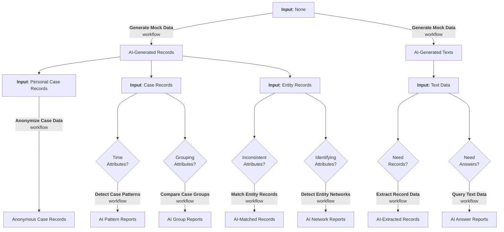

# Intelligence Toolkit

  
  
  

The Intelligence Toolkit is a suite of interactive workflows for creating AI intelligence reports from real-world data sources. It helps users to identify patterns, themes, relationships, and risks within complex datasets, with generative AI ([GPT models](https://platform.openai.com/docs/models/)) used to create reports on findings of interest.

The project page can be found at [github.com/microsoft/intelligence-toolkit](https://github.com/microsoft/intelligence-toolkit/) or [aka.ms/itk](https://aka.ms/itk).

Instructions on how to run and deploy Intelligence Toolkit can be found [here](https://github.com/microsoft/intelligence-toolkit/blob/main/DEVELOPING.md).

## Transparency FAQ

### What can Intelligence Toolkit do?

The Intelligence Toolkit aims to help domain experts make sense of real-world data at a speed and scale that wouldn't otherwise be possible. It was specifically designed for analysis of case, entity, and text data:

- **Case Data**
  - Units are structured records describing individual people.
  - Analysis aims to inform *policy* while preserving *privacy*.
- **Entity Data**
  - Units are structured records describing real-world entities.
  - Analysis aims to understand *risks* represented by *relationships*.
- **Text Data**
  - Units are collections or instances of unstructured text documents.
  - Analysis aims to retrieve *information* and summarize *themes*.

### What are Intelligence Toolkit's intended uses?

The Intelligence Toolkit is designed to be used by domain experts who are familiar with the data and the intelligence they want to derive from it. Users should be independently capable of evaluating the quality of data insights and AI interpretations before taking action, e.g., sharing intelligence outputs or making decisions informed by these outputs.

It supports a variety of interactive workflows, each designed to address a specific type of intelligence task:

- **Case Intelligence Workflows**
  - [`Anonymize Case Data`](https://github.com/microsoft/intelligence-toolkit/blob/main/app/workflows/anonymize_case_data/README.md) generates differentially-private datasets and summaries from sensitive case records.
  - [`Detect Case Patterns`](https://github.com/microsoft/intelligence-toolkit/blob/main/app/workflows/detect_case_patterns/README.md) generates reports on patterns of attribute values detected in streams of case records.
  - [`Compare Case Groups`](https://github.com/microsoft/intelligence-toolkit/blob/main/app/workflows/compare_case_groups/README.md) generates reports by defining and comparing groups of case records.
- **Entity Intelligence Workflows**
  - [`Match Entity Records`](https://github.com/microsoft/intelligence-toolkit/blob/main/app/workflows/match_entity_records/README.md) generates fuzzy record matches across different entity datasets.
  - [`Detect Entity Networks`](https://github.com/microsoft/intelligence-toolkit/blob/main/app/workflows/detect_entity_networks/README.md) generates reports on risk exposure for networks of related entities.
- **Text Intelligence Workflows**
  - [`Query Text Data`](https://github.com/microsoft/intelligence-toolkit/blob/main/app/workflows/query_text_data/README.md) generates reports from a collection of text documents.
  - [`Extract Record Data`](https://github.com/microsoft/intelligence-toolkit/blob/main/app/workflows/extract_record_data/README.md) generate schema-aligned JSON objects and CSV records from unstructured text.
  - [`Generate Mock Data`](https://github.com/microsoft/intelligence-toolkit/blob/main/app/workflows/generate_mock_data/README.md) generates mock records and texts from a JSON schema defined or uploaded by the user.

All tutorial data and examples used in Intelligence Toolkit were created for this purpose using the [`Generate Mock Data`](https://github.com/microsoft/intelligence-toolkit/blob/main/app/workflows/generate_mock_data/README.md) workflow.

### How was Intelligence Toolkit evaluated?

The Intelligence Toolkit was designed, refined, and evaluated in the context of the [Tech Against Trafficking (TAT)](https://techagainsttrafficking.org/) accelerator program with [Issara Institute](https://www.issarainstitute.org/) and [Polaris](https://polarisproject.org/) (2023-2024). It includes and builds on prior accelerator outputs developed with [Unseen](https://www.unseenuk.org/) (2021-2022) and [IOM](https://www.iom.int/)/[CTDC](https://www.ctdatacollaborative.org/) (2019-2020). See this [launch blog](https://www.microsoft.com/en-us/research/blog/empowering-ngos-with-generative-ai-in-the-fight-against-human-trafficking/) for more information.

Additionally, a comprehensive system evaluation was performed from the standpoint of Responsible Artificial Intelligence (RAI). This evaluation was carried out utilizing the GPT-4 model. It is important to note that the choice of model plays a significant role in the evaluation process. Consequently, employing a model different from GPT-4 may yield varying results, as each model possesses unique characteristics and processing methodologies that can influence the outcome of the evaluation. Please refer to this [Overview of Responsible AI practices](https://learn.microsoft.com/en-us/legal/cognitive-services/openai/overview) for more information.

### What are the limitations of Intelligence Toolkit? How can users minimize the impact of these limitations when using the system?

- The Intelligence toolkit aims to detect and explain patterns, relationships, and risks in data provided by the user. It is not designed to make decisions or take actions based on these findings.
- The statistical "insights" that it detects may not be insightful or useful in practice, and will inherit any biases, errors, or omissions present in the data collecting/generating process. These may be further amplified by the AI interpretations and reports generated by the toolkit.
- The generative AI model may itself introduce additional statistical or societal biases, or fabricate information not present in its grounding data, as a consequence of its training and design.
- Users should be experts in their domain, familiar with the data, and both able and willing to evaluate the quality of the insights and AI interpretations before taking action.
- The system was designed and tested for the processing of English language data and the creation of English language outputs. Performance in other languages may vary and should be assessed by someone who is both an expert on the data and a native speaker of that language.

### What operational factors and settings allow for effective and responsible use of Intelligence Toolkit?

- The Intelligence Toolkit is designed for moderate-sized datasets (e.g., 100s of thousands of records, 100s of PDF documents). Larger datasets will require longer to process and may exceed the memory limits of the execution environment.
- Responsible use of personal case data requires that the data be deidentified prior to uploading and then converted into anonymous data using the Anonymize Case Data workflow. Any subsequent analysis of the case data should be done using the anonym case data, not the original (sensitive/personal) case data.
- It is the user's responsibility to ensure that any data sent to generative AI models is not personal/sensitive/secret/confidential, that use of generative AI models is consistent with the terms of service of the model provider, and that such use incurs per-token costs charged to the account linked to the user-provided API key. Understanding usage costs ([OpenAI](https://openai.com/pricing#language-models), [Azure](https://azure.microsoft.com/en-us/pricing/details/cognitive-services/openai-service/)) and setting a billing cap ([OpenAI](https://platform.openai.com/docs/guides/production-best-practices/setting-up-your-organization)) or budget ([Azure](https://learn.microsoft.com/en-us/azure/ai-services/openai/how-to/manage-costs)) is recommended.

### What data is collected?

Intelligence Toolkit may be deployed as a desktop application or a cloud service. The application supports short, end-to-end workflows from input data to output reports. As such, it stores no data beyond the use of a caching mechanism for text embeddings that avoids unnecessary recomputation costs. No data is collected by Microsoft or sent to any other service other than the selected AI model API.

### What AI model is used?

The system uses the GPT-4 model from OpenAI, either via OpenAI or Azure OpenAI APIs. See the [GPT-4 System Card]((https://cdn.openai.com/papers/gpt-4-system-card.pdf)) to understand the capabilities and limitations of this model. For models hosted on Azure OpenAI, also see the accompanying [Transparency Note](https://learn.microsoft.com/en-us/legal/cognitive-services/openai/transparency-note).

## Disclaimer

- Intelligence Toolkit is an AI system that generates text.
- System performance may vary by workflow, dataset, query, and response.
- Outputs may include factual errors, fabrication, or speculation.
- Users are responsible for determining the accuracy of generated content.
- System outputs do not represent the opinions of Microsoft.
- All decisions leveraging outputs of the system should be made with human oversight and not be based solely on system outputs.
- The system is only intended to be used for analysis by domain experts capable of evaluating the quality of data insights it generates.
- Use of the system must comply with all applicable laws, regulations, and policies, including those pertaining to privacy and security.
- The system should not be used in highly regulated domains where inaccurate outputs could suggest actions that lead to injury or negatively impact an individual's legal, financial, or life opportunities.
- Intelligence Toolkit is meant to be used to evaluate populations and entities, not individuals, identifying areas for further investigation by human experts.
- Intelligence Toolkit is not meant to be used as per se evidence of a crime or to establish criminal activity.

## Prohibited Uses

All use of Intelligence Toolkit should be consistent with this documentation. In addition, using the system in any of the following ways is strictly prohibited:

- Pursuing any illegal purpose.
- Identifying or evaluating individuals.
- Establishing criminal activity.

## Getting Started

### Setting up the AI model

Intelligence Toolkit can be used with either OpenAI or Azure OpenAI as the generative AI API.

The [`Generate Mock Data`](https://github.com/microsoft/intelligence-toolkit/blob/main/app/workflows/generate_mock_data/README.md) and [`Extract Record Data`](https://github.com/microsoft/intelligence-toolkit/blob/main/app/workflows/extract_record_data/README.md) workflows additionally use OpenAI's Structured Outputs API, which requires a gpt-4o model as follows:

- `gpt-4o-mini`
- `gpt-4o`

You can access the `Settings` page on the left sidebar when running the application:

- For OpenAI, you will need an active OpenAI account ([create here](https://platform.openai.com/login)) and API key ([create here](https://platform.openai.com/account/api-keys)).

- For Azure OpenAI, you will need an active Azure account ([create here](https://portal.azure.com/)), endpoint, key and version for the AI Service ([create here](https://portal.azure.com/#view/Microsoft_Azure_ProjectOxford/CognitiveServicesHub/~/OpenAI)).

### Selecting the right workflow for the data and task

Use the diagram to identify an appropriate workflow, which can be opened from the left sidebar while running the application.

## Diving Deeper

### NGOs

Non-profit organizations can apply for an annual Azure credit grant of up to $3,500, which can be used to set up and run an instance of the intelligence-toolkit app for your organization.

[Read more about eligibility and registration here](https://nonprofit.microsoft.com/en-us/getting-started)

### Getting started

- To start using the api, install it via pypi.

      pip install intelligence-toolkit

      # Find examples in the `example_notebooks` folder.

- To pull the latest docker image with the app interface, pull it with docker.

      docker pull ghcr.io/microsoft/intelligence-toolkit:latest

- To start developing, see [DEVELOPING.md](./DEVELOPING.md).
- To learn about our contribution guidelines, see [CONTRIBUTING.md](./CONTRIBUTING.md).
- For license details, see [LICENSE.md](./LICENSE.md).

If you have any questions or need further assistance, you can reach out to the project maintainers at [itkteam@microsoft.com](mailto:itkteam@microsoft.com).

## Trademarks

- This project may contain trademarks or logos for projects, products, or services.
- Authorized use of Microsoft trademarks or logos is subject to and must follow [Microsoft's Trademark & Brand Guidelines](https://www.microsoft.com/en-us/legal/intellectualproperty/trademarks/usage/general).
- Use of Microsoft trademarks or logos in modified versions of this project must not cause confusion or imply Microsoft sponsorship.
- Any use of third-party trademarks or logos are subject to those third-party's policies.

## Privacy

See [Microsoft Privacy Statement](https://privacy.microsoft.com/en-us/privacystatement).
